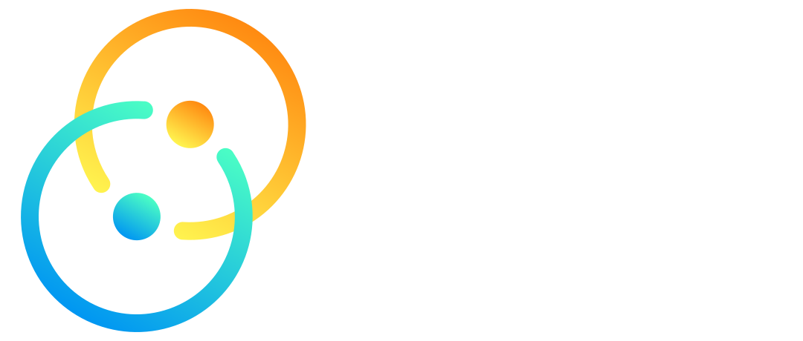

# Awesome Tauri 

> Like Electron, just way better.

## Contents

- [Backing](#backing)
- [Examples](#examples)
- [Comparisons](#comparisons)
- [Documentation](#documentation)
- [Videos](#videos)

## Backing

- [Sponsors, Collaborators, Patrons](https://tauri.studio/en/partners)

## Examples

- [Official showcases](https://tauri.studio/en/showcase)
- [Examples on GitHub](https://github.com/search?q=topic%3Atauri)
  - [Angular frontend](https://github.com/search?q=topic%3Atauri+topic%3Aangular)
  - [Mint frontend](https://github.com/search?q=topic%3Atauri+topic%3Amint)
  - [React frontend](https://github.com/search?q=topic%3Atauri+topic%3Areact)
  - [Svelte frontend](https://github.com/search?q=topic%3Atauri+topic%3Asvelte)
  - [Vue frontend](https://github.com/search?q=topic%3Atauri+topic%3Avue)

## Comparisons

- [web-to-desktop-framework-comparison](https://github.com/Elanis/web-to-desktop-framework-comparison)

## Documentation

- [Book landing page](https://tauri.studio/en/docs/about/book)
- [Getting started](https://tauri.studio/en/docs/getting-started/intro)
- [Usage](https://tauri.studio/en/docs/usage/intro)
- [Governance](https://tauri.studio/en/docs/about/governance)
- [Security](https://tauri.studio/en/docs/about/security)

## Sources

- [tauri](https://github.com/tauri-apps/tauri)
- [tauri API](https://tauri.studio/en/docs/api/config) - Configuration, CLI, Rust and JavaScript.
- [tauri Release notes](https://tauri.studio/en/release-notes)
- [tauri Roadmap](https://tauri.studio/en/#roadmap)
- [tauri-action](https://github.com/tauri-apps/tauri-action) - Build your Web application as a Tauri binary for MacOS, Linux and Windows.
- [tauri-vscode](https://github.com/tauri-apps/tauri-vscode) - Visual Studio Code Extension for Tauri apps development.

## Videos

- [Tauri Fireside #1: History and Philosophy](https://www.youtube.com/watch?v=UxTJeEbZX-0)
- [Create, develop and build native desktop apps with Tauri.](https://www.youtube.com/watch?v=BhmXTi0X7Kg)
